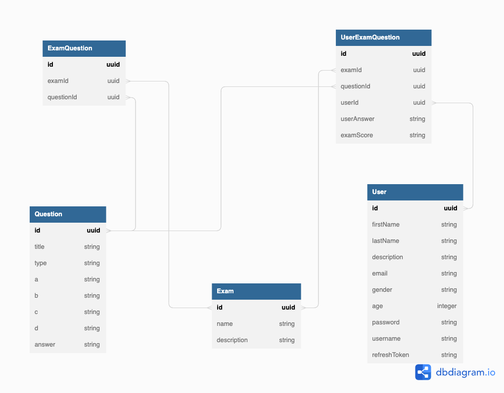

# Quizz app

## How to deploy to a VPS

- SSH to the VPS
- Install docker followed by instruction on docker homepage
- Run the commands below to reset running docker containers and docker images:

```bash
# Remove containers and volumes
docker compose down -v

# Remove images
docker rmi -f $(docker images -aq)

# Run all client + server + database
docker compose up -d

# Run all server + database
docker compose -f docker-compose-server-database.yml up -d

# Run only database
docker compose -f docker-compose-database.yml up -d
```

**Noted**:
| Docker image    | Expose port |
| --------------- | :---------: |
| client          |    80       |
| server          |    8000     |
| mysql           |    3306     |

## API

Authentication

- POST /api/v1/auth/register: api for register
- POST /api/v1/auth/login: api for logging in
- POST /api/v1/auth/refresh: api for sending refresh token and re-new access token

Init [`data`](./server/database)

- GET /api/v1/init-data/questions: api for initialize questions data
- GET /api/v1/init-data/exams: api for initialize exams data
- GET /api/v1/init-data/users: api for initialize users data (for test purpose. You don't need this because there are login/register screens for you now)

Exams

- GET /api/v1/exams: api for getting list exams
- GET /api/v1/exams/<:id>: api for getting exam detail data
- POST /api/v1/exams/<:id>: api for marking score of exam

Dashboard

- GET /api/v1/dashboard: api for getting list exams by admin
- POST /api/v1/dashboard/create: api for creating question exam

## Database sturcture


